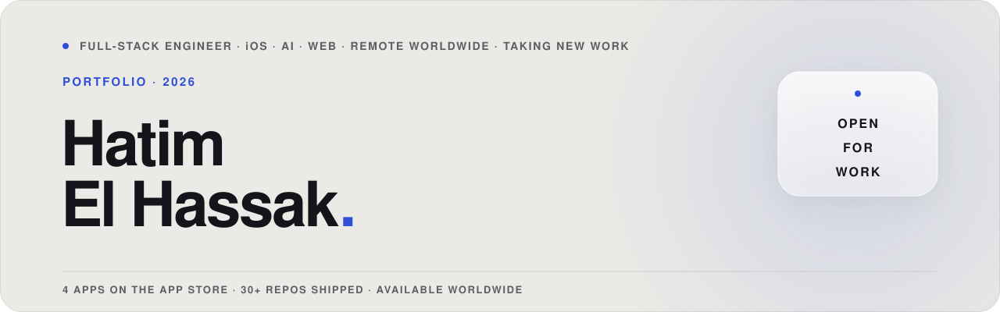
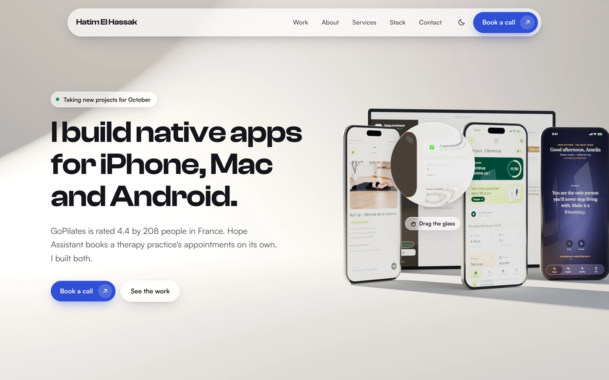
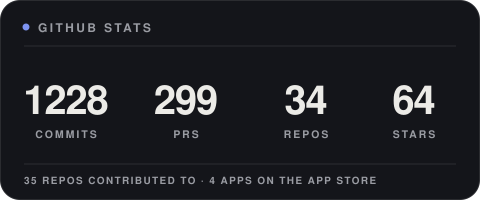
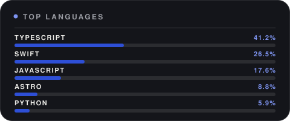

  <picture>
    <source media="(prefers-color-scheme: dark)" srcset="assets/hero-banner-dark.svg" />
    
  </picture>

  
  
  
  

  <table>
    <tr>
      <td width="160" align="center">
        
      </td>
      <td width="600" align="left">
        <em>Full-stack engineer. I build iOS apps, AI pipelines, and production web tools end-to-end, from brief to App Store, or brief to Vercel, on tight timelines.</em>
      </td>
    </tr>
  </table>

## Live on the App Store

<table>
  <tr>
    <td width="50%" align="center" valign="top">
      
      <h3 align="center">GoPilates</h3>
      
<em>Virtual Pilates studio, guided sessions, paywalled premium content, full subscription pipeline.</em>

      
<code>SwiftUI</code> · <code>StoreKit 2</code> · <code>RevenueCat</code>

      

        
      

      

        
        
        
      

    </td>
    <td width="50%" align="center" valign="top">
      
      <h3 align="center">TryIt</h3>
      
<em>AI virtual try-on. Photograph any garment in-store or online, see it on yourself instantly.</em>

      
<code>SwiftUI</code> · <code>AI / CV</code> · <code>StoreKit 2</code>

      

        
      

      

        
        
        
      

    </td>
  </tr>
</table>

## Selected case studies

> _Private flagship work: described, not linked. Source on request._

<table>
  <tr>
    <td width="50%">
      <h3 align="center">📊 Viral OS</h3>
      

      
<em>Command center for a B2C app studio. App Store Connect + RevenueCat + TikTok + ad spend, all in one schema. Predicted LTV, cohort retention, anomaly alerts, Gemini AI on every surface, from "Today's Focus" to per-app health scores.</em>

      
<code>Next.js 14</code> <code>TypeScript</code> <code>Supabase</code> <code>Gemini AI</code> <code>Sentry</code>

    </td>
    <td width="50%">
      <h3 align="center">🤖 J.A.R.V.I.S.</h3>
      

      
<em>Self-hosted personal AI assistant. Voice-driven, modular, runs entirely on a 2017 MacBook with $0 of paid APIs, free-tier toolkit only. Dockerized core, custom dashboard, deployment scripts.</em>

      
<code>Python</code> <code>Docker</code> <code>FastAPI</code> <code>Free-tier LLMs</code>

    </td>
  </tr>
  <tr>
    <td width="50%">
      <h3 align="center">🎬 Lumi</h3>
      

      
<em>A private cinema for two. AI-tuned picks across film and TV with collections, watchlists, recap mode, and shareable invitation cards. TMDB + Gemini under the hood.</em>

      
<code>Next.js</code> <code>TypeScript</code> <code>Gemini AI</code> <code>Supabase</code> <code>TMDB</code>

    </td>
    <td width="50%">
      <h3 align="center">💼 Freelane</h3>
      

      
<em>Freelance studio in a tab. Clients, projects, time, and PDF invoicing: drag-and-drop boards, Recharts dashboards, real-time Supabase backend.</em>

      
<code>Next.js</code> <code>TypeScript</code> <code>Supabase</code> <code>react-pdf</code> <code>Recharts</code>

    </td>
  </tr>
</table>

  

## Featured public projects

<table>
  <tr>
    <td width="50%">
      

        
      

      <h3 align="center">🏗️ Luxury Engineering Portfolio</h3>
      

        
        
      

      
<em>Light, glass-and-stone portfolio: real Liquid Glass refraction in the browser, Blender-rendered scenes, and a case study for each of 39 projects.</em>

      
<code>Next.js 14</code> <code>TypeScript</code> <code>Tailwind</code> <code>Framer Motion</code> <code>Blender</code>

    </td>
    <td width="50%">
      <h3 align="center">🎯 LeadSniper</h3>
      

        
      

      
<em>AI lead-generation engine: scrapes Google Places, crawls sites with Playwright, scores leads across 23 factors, drafts outreach with Gemini. Real-time Next.js dashboard on Supabase.</em>

      
<code>Next.js 14</code> <code>TypeScript</code> <code>Supabase</code> <code>Playwright</code> <code>Gemini</code>

    </td>
  </tr>
  <tr>
    <td width="50%">
      <h3 align="center">💬 Relay</h3>
      

        
      

      
<em>Premium native macOS client for Facebook Messenger: SwiftUI + Liquid Glass over a Go backend speaking Meta's real protocol. Universal binary, on-device translation, full local history.</em>

      
<code>SwiftUI</code> <code>Liquid Glass</code> <code>Go</code> <code>macOS 13+</code>

    </td>
    <td width="50%">
      <h3 align="center">🔐 Fortress</h3>
      

        
      

      
<em>Cryptographically secure password generator with entropy analysis, crack-time estimation, and a Rich CLI.</em>

      
<code>Python</code> <code>Typer</code> <code>Rich</code> <code>pytest</code>

    </td>
  </tr>
</table>

  <em>Featured selection: see <a href="https://github.com/hatimhtm?tab=repositories">all repos</a> for the rest.</em>

## How I work

> **Small team, clear loop, real commits.**
> I work the way a solo founder works: one person in the code, a direct line for questions, and a running build you can click on any time. No Jira theatre, no handoffs, no scope creep wrapped as process.

| `01` | `02` | `03` | `04` |
|:---:|:---:|:---:|:---:|
| **BRIEF** | **BUILD** | **SHIP** | **SUPPORT** |
| 30-minute call. Product, users, constraints, deadline. | Heads-down engineering. Public repo from day one: every commit visible. | Production deploy. Real users. Not a staging demo. | On-call for tweaks and bug fixes after launch. No ghosting. |

## Tech stack

**Daily**
&nbsp;

**Comfortable**
&nbsp;

## Stats

  

  
  

## Open for work

**Available globally · Remote · Replies within a day**

Open to engineering work that ships:
- **Founding engineer** or early-stage product roles
- **Contract & freelance**: iOS, web, AI, automation
- **Paywall & monetization**: StoreKit 2, RevenueCat, Stripe, subscription design
- **AI pipelines**: OpenAI, Gemini, Whisper, embeddings, agents
- **MVP builds**: brief to App Store, brief to Vercel
- **Indie collabs · agency partnerships · technical advisory**

> _If it has users and a deadline, I want in._

  

